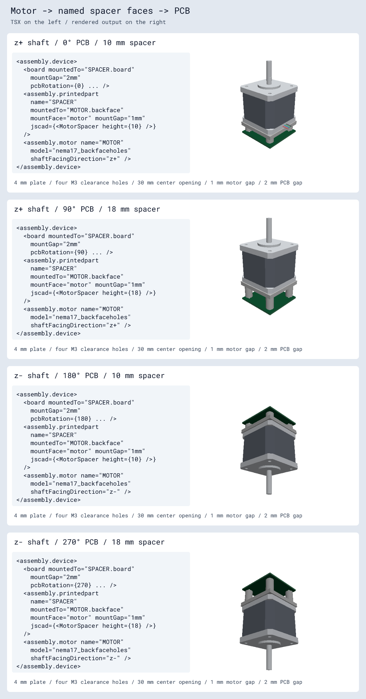
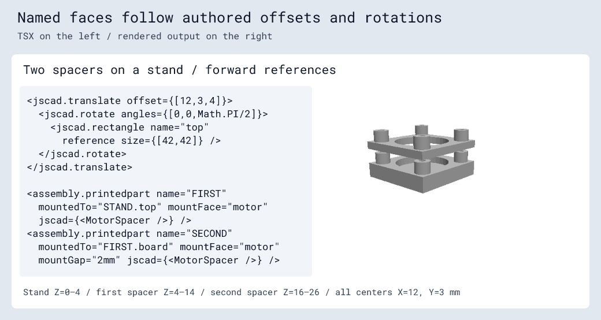

# Printed parts with named mounting faces

`assembly.printedpart` accepts one geometry source: `jscad`, `model`, `modelUrl`,
or `cadModel`. `model`, `modelUrl`, and `cadModel` use the existing assembly CAD
formats, including CAD JSX and model transforms. For example:

```tsx
<assembly.printedpart name="SPACER" modelUrl="./spacer.stl" />
<assembly.printedpart name="BRACKET" cadModel={{ glbUrl: "./bracket.glb" }} />
```

The `jscad` prop compiles jscad-fiber JSX to a serializable plan in
`cad_component.model_jscad`; viewers/exporters generate meshes. Reference rectangles authored with `jscad` define attachment frames and are removed
before emission. Imported models do not acquire named reference faces automatically. Child `assembly.referencesurface` elements can define named faces independently of the geometry, including for imported models.

```tsx
import { assembly, jscad } from "@tscircuit/core"

const holes = [-15.5, 15.5].flatMap(x =>
  [-15.5, 15.5].map(y => [x, y] as const),
)

function MotorSpacer({ height = 10 }: { height?: number }) {
  return <>
    <jscad.subtract>
      <jscad.union>
        <jscad.cuboid size={[42, 42, 4]} center={[0, 0, 2]} />
        {holes.map(([x, y]) => <jscad.cylinder
          key={`${x},${y}`} radius={4} height={height}
          center={[x, y, height / 2]} />)}
      </jscad.union>
      <jscad.cylinder radius={15} height={height + 2}
        center={[0, 0, height / 2]} />
      {holes.map(([x, y]) => <jscad.cylinder
        key={`${x},${y}`} radius={1.6} height={height + 2}
        center={[x, y, height / 2]} />)}
    </jscad.subtract>

    <jscad.rotate angles={[0, Math.PI, 0]}>
      <jscad.rectangle name="motor" size={[42, 42]} reference />
    </jscad.rotate>
    <jscad.translate offset={[0, 0, height]}>
      <jscad.rectangle name="board" size={[42, 42]} reference />
    </jscad.translate>
  </>
}
```

The part has a 4 mm plate, four hollow posts, 3.2 mm M3 clearance holes on 31 mm
centers, and a 30 mm center opening. The `motor` reference is on the plate at
local Z=0, facing -Z. The `board` reference is at the post tips, facing +Z.
Dimensions are millimeters; rotations are radians. Match these dimensions to
the actual motor's rear mounting pattern.

Mount it between a motor and controller:

```tsx
<assembly.device>
  <assembly.motor name="MOTOR" model="nema17_backfaceholes" />
  <assembly.printedpart
    name="SPACER"
    jscad={<MotorSpacer height={10} />}
    mountedTo="MOTOR.backface"
    mountFace="motor"
  />
  <Rp2040MotorController mountedTo="SPACER.board" />
</assembly.device>
```

`Rp2040MotorController` must forward its board props to its underlying `<board>`.
The model string selects open rear holes instead of protruding rear screw heads.
Omitted `mountGap` means the mating faces touch. Set it on the printed part for
motor-to-spacer clearance, or on the board for spacer-to-PCB clearance.

- `mountedTo` selects another part's named face in the same assembly device.
- `mountFace` selects the printed part's own named reference. Supply both face
  props together. Outward normals oppose and in-plane X directions align.
- A rectangle's center is its attachment point, local +Z is its outward normal,
  and local +X fixes its in-plane direction. Transform it with ordinary JSCAD
  operations to change the frame. Names must be unique within the part.
- Nested printed-part chains and forward references work. Without a mounted
  board, the root part remains at its authored origin. One board may anchor each
  connected assembly; cycles and ambiguous/missing targets are errors.
- A mounted board keeps its PCB world plane at Z=0 and its existing XY layout.
  Core moves the attached parts. Its target face must be parallel to XY; motor
  chains currently support `shaftFacingDirection="z+"` and `"z-"`.
- `jscad` accepts pure synchronous function components, fragments, and arrays
  inside JSX. Hooks, async components, and raw kernel geometry are unsupported.

Reference markers never become printable material. Printed-part compilation does not evaluate CSG
or import the modeling kernel. The exported `jscad` namespace uses the headless
entrypoint of jscad-fiber and does not import the Three.js viewer.





## Child reference surfaces, color, and material

```tsx
<assembly.printedpart name="SPACER" modelUrl="./spacer.stl"
  color="#ff8800" material="petg">
  <assembly.referencesurface name="board" plane="xy" centerZOffset="10mm" />
</assembly.printedpart>
<board mountedTo="SPACER.board" />
```

`material` accepts `"pla"`, `"petg"`, or `"nylon"` and is preserved on the source
printed part as manufacturing metadata; it does not change geometry or choose a
color. `color` is preserved on the source and emitted CAD components. Supporting
renderers use it to override authored JSCAD material colors while preserving
roughness, metalness, and opacity. Omitting either prop adds no default.

Child reference names and JSCAD reference names share one namespace and must be
unique. See [reference surfaces](./assembly-reference-surface.md).
