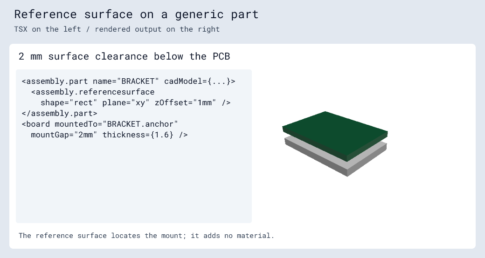

# `<assembly.referencesurface />`

Define an anchor surface as a direct child of `assembly.part` or
`assembly.printedpart`. It supplies a mounting frame without adding visible
geometry, a source component, or a CAD component.

```tsx
<assembly.part name="BRACKET" modelUrl="./bracket.step">
  <assembly.referencesurface shape="rect" plane="xy" zOffset="1mm" />
</assembly.part>
<assembly.printedpart name="SPACER" material="pla" color="orange"
  mountedTo="BRACKET.anchor" mountFace="bottom"
  jscad={<jscad.cuboid size={[10, 10, 4]} center={[0, 0, 2]} />}>
  <assembly.referencesurface name="bottom" normalDirection="z-" />
  <assembly.referencesurface name="top" zOffset="4mm" />
</assembly.printedpart>
```

The default name is `anchor` and the default shape is `rect`. Names must be
unique within the owning part, including any JSCAD reference names.

Offsets locate the surface center in the part's local, right-handed XYZ frame.
`xOffset`, `yOffset`, and `zOffset` accept millimeters or unit strings and default
to zero. They describe the part origin, independently of model-only position
offsets. Mounting uses that center and opposes the mating normals.

| Plane | Default normal | In-plane X direction |
| --- | --- | --- |
| `xy` (default) | `z+` | `x+` |
| `xz` | `y+` | `x+` |
| `yz` | `x+` | `y+` |

`normalDirection` accepts `x+`, `x-`, `y+`, `y-`, `z+`, or `z-` and must
be perpendicular to `plane`: XY accepts `z+`/`z-`, XZ accepts `y+`/`y-`, and YZ
accepts `x+`/`x-`. A negative direction reverses the normal while retaining the
in-plane X direction. The earlier `positive`/`negative` spellings are replaced by
these axis directions. The second tangent follows the right-handed frame, so
XZ with `y+` has its second tangent along -Z. Optional `width` and `height` describe rectangular extents
along the two tangents; provide both as positive distances. They do not alter
the center-based mount or generate material.

Use `mountedTo="PART.surface"` on a board, motor, or printed part. Printed parts
and motors also require their own `mountFace`. Boards retain their PCB world
plane and require a target face parallel to XY. Missing/duplicate references,
attachment cycles, and multiple boards anchoring one connected assembly are
errors.


