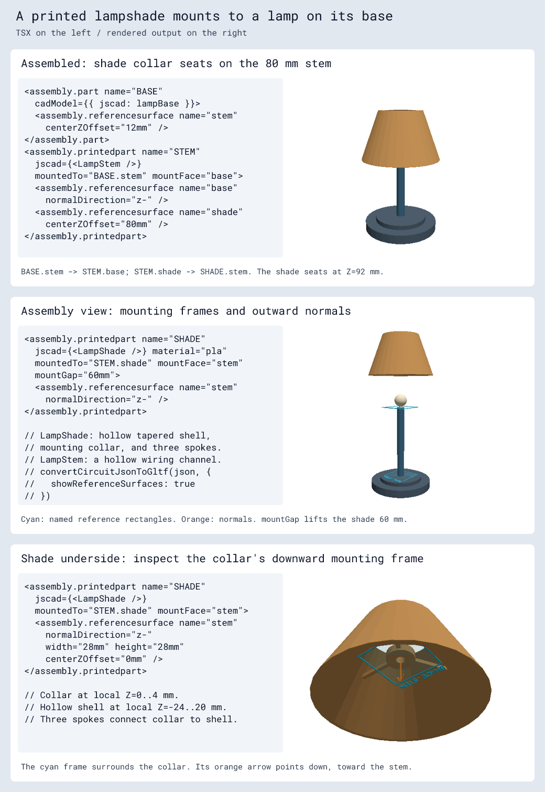

# `<assembly.referencesurface />`

Define an anchor surface as a direct child of `assembly.part` or
`assembly.printedpart`. It supplies a mounting frame without adding visible
geometry, a source component, or a CAD component.

```tsx
<assembly.part name="BRACKET" modelUrl="./bracket.step">
  <assembly.referencesurface shape="rect" plane="xy" centerZOffset="1mm" />
</assembly.part>
<assembly.printedpart name="SPACER" material="pla" color="orange"
  mountedTo="BRACKET.anchor" mountFace="bottom"
  jscad={<jscad.cuboid size={[10, 10, 4]} center={[0, 0, 2]} />}>
  <assembly.referencesurface name="bottom" normalDirection="z-" />
  <assembly.referencesurface name="top" centerZOffset="4mm" />
</assembly.printedpart>
```

The default name is `anchor` and the default shape is `rect`. Names must be
unique within the owning part, including any JSCAD reference names.

Offsets locate the surface center in the part's local, right-handed XYZ frame.
`centerXOffset`, `centerYOffset`, and `centerZOffset` accept millimeters or unit
strings and default to zero. They measure from the part origin, independently of
model-only position offsets. Mounting uses that center and opposes the mating
normals.

| Plane | Default normal | In-plane X direction |
| --- | --- | --- |
| `xy` (default) | `z+` | `x+` |
| `xz` | `y+` | `x+` |
| `yz` | `x+` | `y+` |

`normalDirection` accepts `x+`, `x-`, `y+`, `y-`, `z+`, or `z-` and must
be perpendicular to `plane`: XY accepts `z+`/`z-`, XZ accepts `y+`/`y-`, and YZ
accepts `x+`/`x-`. A negative direction reverses the normal while retaining the
in-plane X direction. The earlier `positive`/`negative` spellings are replaced by
these axis directions. The second tangent follows the right-handed frame, so
XZ with `y+` has its second tangent along -Z. Optional `width` and `height` describe rectangular extents
along the two tangents; provide both as positive distances. They do not alter
the center-based mount or generate material.

Use `mountedTo="PART.surface"` on a board, motor, or printed part. Printed parts
and motors also require their own `mountFace`. Boards retain their PCB world
plane and require a target face parallel to XY. Missing/duplicate references,
attachment cycles, and multiple boards anchoring one connected assembly are
errors.

## Lamp assembly example

A generic base provides `BASE.stem` at Z=12 mm. A hollow printed stem mates its
`base` surface to that anchor and provides `STEM.shade` at its local Z=80 mm.
The printed shade's `stem` surface faces `z-`, so its collar seats on the top of
the stem at world Z=92 mm. The tapered shade is hollow and has three internal
spokes connecting its wall to the mounting collar.

```tsx
<assembly.printedpart name="SHADE" material="pla"
  jscad={<LampShade />}
  mountedTo="STEM.shade" mountFace="stem">
  <assembly.referencesurface name="stem" normalDirection="z-" />
</assembly.printedpart>
```

The second view adds `mountGap="60mm"` to lift the shade for assembly; the bulb,
stem, and base remain in place. Reference surfaces define the attachment frames
without drawing extra geometry. The underside view shows the collar, wiring
hole, and three support spokes. The [complete lamp fixture](../tests/assembly/fixtures/reference-surface-lamp.tsx)
includes the JSCAD base, hollow stem, tapered shell, collar, and spokes.




Core emits each child surface and each printed part's named JSCAD reference as a
`cad_reference_surface` record with its resolved world-space center, normal, and
X tangent. Records belong to the part's source component and are emitted even
when the part has no CAD model. Model offsets do not move these mounting frames.
Schematic-only builds omit CAD reference records.

To inspect the frames in the 3D export:

```ts
const glb = await convertCircuitJsonToGltf(circuit.getCircuitJson(), {
  format: "glb",
  showReferenceSurfaces: true,
})
```

This option defaults to false. Cyan rectangles and names identify the frames;
orange arrows show their outward normals. Explicit `width` and `height` set the
rectangle size. Frames without extents, including named JSCAD references, use a
10 mm diagnostic rectangle. The exploded lamp view above enables this option.
