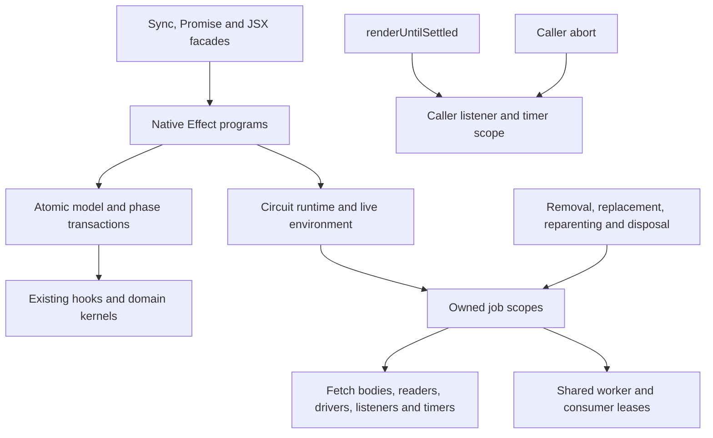

# Effect 4 ownership migration

This draft replaces core's rendering control flow and asynchronous resource
ownership with native Effect 4 programs. Existing circuit, component and JSX
facades retain their synchronous or Promise contracts. Geometry, numerical
solvers, selectors and synchronous subclass hooks remain ordinary domain code.
The inventory covers 539 TypeScript/TSX modules, all 69 phases and 282 existing
synchronous phase hooks. No production `_queueAsyncEffect` call remains.

The dependency is exactly `effect@4.0.0`, verified against the
[official stable release](https://github.com/Effect-TS/effect/releases/tag/effect%404.0.0)
and official npm registry. Implementation uses the installed v4 declarations and
source; v3 website examples and the archived effect-smol project are not its API
reference. The existing ESM package format is preserved.

## Ownership architecture

| Boundary | Native implementation | Preserved contract |
| --- | --- | --- |
| Circuit | `CircuitRuntime`, live environment, render/settlement and disposal | Sync `add`/`render`/selectors; Promise settlement/SVG; Circuit JSON |
| Phase engine | Ordered phase programs, captured state, dependency checks and lifecycle transitions | Synchronous hooks, polymorphic overrides, live child traversal and event ordering |
| Component model | Props, tree, instance/fiber construction and cache programs | Immutable props, Zod errors, component classes and catalogue extensions |
| Loading | Nine owned loading jobs, scoped response bodies/readers, generation guards | Callback identity, parser contracts and ordinary results |
| Routing | Driver/request scopes, timers/listeners and guarded publication | Existing solver algorithms and external driver interfaces |
| Shared work | Independent consumer leases and worker scopes | Cache/pending-map identities and observable consumer lookups |
| DRC, SPICE and React | Owned check/simulation programs and hook circuit scope | Existing checker kernels, Promise methods and hook signatures |



Each queued job captures owner ancestry and receives a `CoreJobScope`.
Removal, reparenting, valid props replacement and disposal interrupt owned work.
`job.commit` suppresses stale writes even when an external callback ignores
cancellation. Interruption resets only the pending generation's loader/routing
guard, preserving explicit revival without discarding completed results.
Shared work has separate worker and consumer scopes: one caller's cancellation
releases its lease; the last caller releases the worker.

`atomicCoreEffect` is the common model/render transaction policy. It defers
interruption and scheduler yielding until the original synchronous transition
completes, including forked and explicitly interruptible callers. Awaited work
belongs to separately owned interruptible jobs. Phase decisions capture state
before hook execution, preserve live iteration and keep lifecycle ordering.

`CoreError` records an operation and its original cause. Public compatibility
boundaries unwrap a single failure to its original value and identity. Compound
operation/finalizer failures retain every original value in `AggregateError`.
The sync boundary interrupts an accidentally asynchronous continuation before
exposing its failure; it does not leave a background mutation running.

## Public behavior and deliberate differences

Existing synchronous methods and synchronous subclass hooks remain supported.
New `*Effect` methods provide native composition. `dispose()` and
`disposeEffect()` close circuit resources; `CoreError` and
`CircuitDisposedError` are additive exports.

- Caller abortion of `renderUntilSettled({ signal })` closes only that wait's
  listener/timer and rejects with the caller's original abort reason. Circuit
  jobs continue until their owner is removed or the circuit is disposed.
- Disposal is terminal and idempotent. It latches before aborting, awaits all
  job/finalizer cleanup, and reports original cleanup failures. Cached Circuit
  JSON remains readable; new circuit rendering/additions/platform changes reject.
  Existing component value APIs remain callable but cannot restart disposed jobs.
- Removed, replaced or reparented work cannot publish late mutations. React
  unmount or dependency changes dispose the hook-owned circuit.
- An async-end observer failure is diagnosed once after balanced completion
  bookkeeping, avoiding a second completion event or unhandled rejection.

Adding a removed component does not automatically clear `shouldBeRemoved`.
Callbacks without an abort/close contract may continue their underlying IO;
owned waits cancel promptly and late writes are suppressed. Extensions that
create uninterruptible asynchronous programs own their lifetime explicitly.
The historical opt-in footprint prototype remains distinct from production
loading and retains its custom-decoder/cleanup diagnostic limits.

## Validation and evidence boundaries

The isolated pre-publication freeze based on official commit
`80ba2c4b07b88113d1e1d9724ffd66ae1d3aaa5e` completed **all 1,658 test files**:
1,864 passing cases, no failures or unhandled errors, and 51 unchanged upstream
skips. Independent replay of 96 raw batches verified source/dependency/harness
hashes, all requested/reached/completed paths, latest-attempt totals, retries,
aggregate footers and unchanged skip source bytes. Existing test sources and
snapshots were not rewritten to obtain that result; 153 migration files were
added. This is not a full upstream control run.

Frozen input SHA256:
`5a2b45aae23c5e1b21c4642299e600791fc004f8f5c2e55cb5b6c190623c1c24`.
The six long routing files completed separately, including the LED matrix
(286 seconds), AM62L (52 seconds) and HDMI (41 seconds).

That same freeze passed TypeScript 5.9.3 no-emit checking, ESM/declarations build,
distribution smoke and eight full-JSON/event differential fixtures. A ninth
fixture verifies the intentional removal/cancellation difference. Differential
comparison preserves IDs, array order, geometry and fields. Baseline/rewrite run
in isolated processes with audited module aliases and constructor identity.

This publication branch starts from official
`a61451654ff1f8bb0249f135dca482a84bedb802` (0.0.2033), retaining its autorouter
0.0.951, checks 0.0.231, updated snapshots and added wide-trace regression.
It also deduplicates the atomic policy and moves two test-only audit helpers
into portable `scripts/effect-4` modules. The pre-publication full-suite result
therefore applies to its recorded freeze, not automatically to this head.
Local publication checks pass: all 153 migration tests (1,782 assertions), the
new upstream regression, TypeScript no-emit checking, ESM/declarations build and
distribution smoke. Declarations retain SHA256
`898ece7d9caad959e337b7f71c2be4eb73b68d3f0a1645ff134f1e90acd8b605`.
GitHub CI must complete on the resulting publication head before it is certified.
Raw workstation logs, process metadata, dependency directories and advisory
session output are intentionally absent from the public branch.

Audit source coverage with:

```sh
bun scripts/effect-4/inventory.ts
bun test tests/effect-4 tests/effect-4-rewrite --timeout 30000
bunx tsc --noEmit
bun run build
bun run smoke-test:dist
```

## Compatibility limits

Matched published-declaration controls have byte-identical upstream/rewrite
diagnostics in six compiler/environment pairs. TypeScript 5.9.3 with Bun ambient
types passes. Browser 5.9.3 inherits two `RuntimeGlobal` errors from direct and
nested `@tscircuit/fanout-solver/lib/fanout-solver.ts:87`; TypeScript 5.0.4 and
5.4.5 inherit further raw-source dependency errors. The existing `^5.0.0` peer
range is not fully certified by this experiment.

Native transports currently require `AbortSignal.any`. Runtime evidence covers
Bun 1.4.0. Node documents this feature from
[18.17.0 / 20.3.0](https://nodejs.org/api/globals.html#static-method-abortsignalanysignals).
Older hosts need a scoped adapter or an agreed runtime minimum. Browser bundling
passes; browser/worker/Node execution and downstream custom extensions still
need integration coverage.

## Runtime measurements

Readability and clear Effect ownership take priority over microoptimization.
Measured overhead remains visible and is not an adoption blocker by itself.
Controlled measurements use nine samples, two untimed warmups, five warm calls
per instance, serial execution and output/callback parity. Startup, JSX
construction, checksum and cleanup are excluded from warm render timing.

| Fixture/check | Official baseline | Frozen rewrite | Cost |
| --- | --- | --- | --- |
| Static warm render | 0.21–0.26 ms | about 2.88 ms | +2.62–2.67 ms, 11–14x this small baseline |
| Async cold total | about 2.75 ms | about 7.4 ms | about 2.7x |
| Complete browser bundle, minified | 10,716,981 bytes | 10,801,466 bytes | +84,485 bytes, 0.79% |
| Complete browser bundle, gzip | 2,755,390 bytes | 2,784,713 bytes | +29,323 bytes, 1.06% |

A sampled CPU profile confirmed repeated service-context cache construction in
nested atomic boundaries. Reusing an active public Effect reference reduced the
preceding 4.46 ms static warm-render median by about 36%, preserving transaction
masks and reference restoration. Context-frame sampling fell from 25% to below
0.03%. Profiles are diagnostic; benchmark values come from unprofiled controls.
These small fixtures do not establish production throughput or sustained heap
behavior, and are measurements of the recorded freeze.

## Architectural consultation

The requested exact Opus 5.5 consultation ran successfully with Claude CLI
2.1.286, canonical response model `claude-opus-5-5`. Bounded questions covered
phase ordering, synchronous public adapters, cancellation, shared work and
cleanup/error ownership. Only relevant public core source and architecture
questions were supplied; tool/MCP access and competing edits were disabled.

Advice was treated as untrusted input. The asynchronous sync-boundary
continuation leak, automatic scheduler yielding and loss of multiple cleanup
causes were reproduced and fixed. A proposed `forEach` snapshot concern was
rejected after checking Effect 4's actual live-iterator implementation. Global
settlement sharing was rejected because caller cancellation needs independent
wait ownership. No substitute model was used.

## Integration plan and recommendation

1. Review the complete draft by ownership boundary: error/runtime contracts,
   phase/model transactions, loading/routing scopes, shared leases, then public
   facades. Keep the module inventory explicit and final-head CI complete.
2. Exercise downstream custom hooks, catalogue entries, parsers/callbacks,
   pending maps, routing drivers, DRC checkers and React lifecycle changes.
   Confirm supported browser/worker/Node/Bun environments and signal support.
3. Resolve inherited declaration failures before claiming the full TypeScript
   peer range. Agree on transport cancellation contracts and runtime minimums.
4. Adopt only through normal maintainer review after compatibility and runtime
   gates are met. Roll back by selecting the complete prior package/branch;
   mixing old and new ownership models has no runtime switch.

**Go for draft architectural review and downstream integration.** Hold a stable
release until supported-runtime and downstream compatibility gates are complete.
The benefits are explicit owner ancestry, independent shared leases, prompt
cancellable waits, stale-write protection and complete scoped cleanup. Costs are
the runtime dependency, Effect service/scope concepts for extension authors,
intentional cancellation behavior and measured dispatch overhead.
