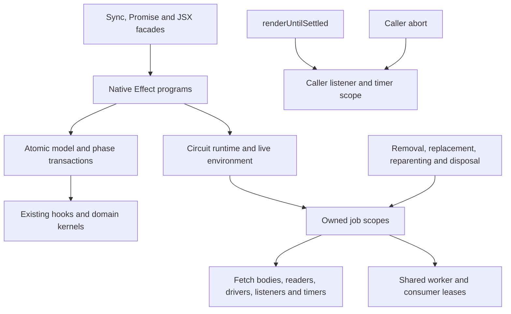

# Effect 4 ownership migration

This draft replaces core's rendering control flow and asynchronous resource
ownership with native Effect 4 programs. Existing circuit, component and JSX
facades retain their synchronous or Promise contracts. Geometry, numerical
solvers, selectors and synchronous subclass hooks remain ordinary domain code.
The inventory covers 540 TypeScript/TSX modules, all 69 phases and 282 existing
synchronous phase hooks. No production `_queueAsyncEffect` call remains.

The dependency is exactly `effect@4.0.0`, verified against the
[official stable release](https://github.com/Effect-TS/effect/releases/tag/effect%404.0.0)
and official npm registry. Implementation uses the installed v4 declarations and
source; v3 website examples and the archived effect-smol project are not its API
reference. The existing ESM package format is preserved.

## Ownership architecture

| Boundary | Native implementation | Preserved contract |
| --- | --- | --- |
| Circuit | `CircuitRuntime`, live environment, render/settlement and disposal | Sync `add`/`render`/selectors; Promise settlement/SVG; Circuit JSON |
| Phase engine | Ordered phase programs, captured state, dependency checks and lifecycle transitions | Synchronous hooks, polymorphic overrides, live child traversal and event ordering |
| Component model | Props, tree, instance/fiber construction and cache programs | Immutable props, Zod errors, component classes and catalogue extensions |
| Loading | Nine owned loading jobs, scoped response bodies/readers, generation guards | Callback identity, parser contracts and ordinary results |
| Routing | Driver/request scopes, timers/listeners and guarded publication | Existing solver algorithms and external driver interfaces |
| Shared work | Independent consumer leases and worker scopes | Cache/pending-map identities and observable consumer lookups |
| DRC, SPICE and React | Owned check/simulation programs and hook circuit scope | Existing checker kernels, Promise methods and hook signatures |



Each queued job captures owner ancestry and receives a `CoreJobScope`.
Removal, reparenting and disposal interrupt owned work. Valid props replacement
targets the component's own jobs and applies each site's cancel/finish policy;
it does not cancel descendant jobs. Native publications through `job.commit`
are suppressed when their owner is stale, even when a borrowed callback ignores
cancellation. The legacy callback adapter has no such publication boundary.
Pending loader/routing guards
are released on terminal cancellation without marking phases dirty. Explicit
component revival remains required before a new generation can run.
Shared work has separate worker and consumer scopes: one caller's cancellation
releases its lease; the last caller releases the worker.

`atomicCoreEffect` is the common model/render transaction policy. It defers
interruption and scheduler yielding until the original synchronous transition
completes, including forked and explicitly interruptible callers. Awaited work
belongs to separately owned interruptible jobs. Phase decisions capture state
before hook execution, preserve live iteration and keep lifecycle ordering.

`CoreError` records an operation and its original cause. Public compatibility
boundaries unwrap a single failure to its original value and identity. Compound
operation/finalizer failures retain every original value in `AggregateError`.
The sync boundary interrupts an accidentally asynchronous continuation before
exposing its failure; it does not leave a background mutation running.

## Public behavior and deliberate differences

Existing synchronous methods and synchronous subclass hooks remain supported.
New `*Effect` methods provide native composition. `dispose()` and
`disposeEffect()` close circuit resources; `CoreError` and
`CircuitDisposedError` are additive exports.

- Caller abortion of `renderUntilSettled({ signal })` closes only that wait's
  listener/timer and rejects with the caller's original abort reason. Circuit
  jobs continue until their owner is removed or the circuit is disposed.
- Disposal is terminal and idempotent. It latches before aborting, awaits all
  job/finalizer cleanup, and reports original cleanup failures. Cached Circuit
  JSON remains readable; new circuit rendering/additions/platform changes reject.
  Existing component value APIs remain callable but cannot restart disposed jobs.
- Native jobs guard publication after removal, cancelled replacement or
  reparenting. The legacy `_queueAsyncEffect` callback remains uncontrolled:
  removal, reparenting or disposal can finish its owned wait and emit
  `asyncEffect:end` before the original callback ends. That callback can still
  mutate the component or database afterwards. This is an experimental
  cancellation difference, not a stale-write guarantee for legacy extensions.
- React unmount or dependency changes dispose the hook-owned circuit. Failure
  after circuit construction, including an `add` or hook callback throw, also
  disposes it. The baseline did not dispose that constructed circuit on its
  error path; this is a deliberate resource-lifetime difference.
- An async-end observer failure is diagnosed once after balanced completion
  bookkeeping, avoiding a second completion event or unhandled rejection.

Adding a removed component does not automatically clear `shouldBeRemoved`.
Borrowed callbacks without an abort/close contract may continue underlying IO;
native jobs guard their eventual publication. Legacy callbacks control their
own writes and retain finish-on-own-props-update behavior. Extensions that
create uninterruptible asynchronous programs own their lifetime explicitly.
The historical opt-in footprint prototype remains distinct from production
loading and retains its custom-decoder/cleanup diagnostic limits.

## Revision cancellation and resource policies

These sections describe the revised source and the tests intended to certify it.
Final commit, repeated characterization, full-suite and review evidence are
pending; the historical results below do not certify this revision. All 69
phases still use native orchestration. Numerical/domain bodies and synchronous
extension hooks retain their ordinary implementations.

`CoreJobCancellationPolicy` is optional on the existing `_queueEffect` call
shape. Production sites declare `propsChange: "cancel"` or `"finish"` next to
their submission. `CircuitRuntime` records `props_changed`, `reparented`,
`removed`, `disposed` or `superseded` internally, while the signal handed to
external transports retains the platform's default `AbortError` reason.
Cancellation aborts first and invokes `onCancel` synchronously, so a policy
failure can propagate from `setProps` rather than becoming an asynchronous
event-listener exception. Cancellation continues across other owned jobs when
one policy throws; disposal still awaits cleanup and reports those failures.
Props updates retain two baseline parses and their order. A failed merged-props
parse changes nothing. After that parse succeeds, raw `props` are replaced
before the supplied partial object is parsed. A partial parse failure therefore
leaves the new raw props, prior `_parsedProps` and original error, without
cancelling jobs or notifying observers. Cancellation follows successful partial
validation; its callback can see new raw props and prior parsed props. If a new
native cancellation policy throws, prior raw props are restored and the original
error escapes; parsed props remain unchanged and cancelled jobs still drain.
That policy-failure behavior is an experimental native extension boundary.

The chosen props policy follows captured-input behavior. Narrowing cancellation
to the owner's jobs preserves pending descendants across ancestor updates.
Finish policies retain work begun with captured props, child lists or Circuit
JSON snapshots. They do **not** promise the output of a fresh render with
arbitrary final props: some transforms, parent identifiers and helpers are read
at commit time, as in the baseline. Cancelling and reattaching isolated children
would reuse initialized phase state and links into a disposed child circuit;
the finish policy avoids that unsafe restart path.

Terminal guard cleanup and rearming are separate operations. Removal/disposal
must release pending/in-progress guards and owned resources, but must not mark
phases dirty, restart IO or emit a domain diagnostic. Non-terminal cancellation
of the loading/routing families synchronously releases the pending guard and
marks the corresponding phase dirty. Routing additionally checks generation and
the result captured at job start, so an old finalizer cannot clear a newer
guard or discard a completed result. A later terminal reason upgrades the
internal cancellation reason without invoking the policy twice.

Explicit revival needs one bounded compatibility exception: removal retains
the parent link, so clearing `shouldBeRemoved` and adding to the same parent
before a removal phase runs can otherwise leave an initialized phase clean.
For native queued jobs with an explicit `onCancel`, the revision records the
registration phase at removal without changing phase flags. A later active
ancestry/open-runtime phase preparation consumes that hint through the explicit
`resumeInterruptedPhase` hook before reading flags; `getState` remains pure:
an initialized phase becomes dirty, while an uninitialized phase takes its
normal initial path. Disposal records no hint. This does not dirty a terminal
component, automatically clear its removal flag, or change completed
remove/readd behavior. Implementation and final revival certification remain
part of the pending revision gate.

The following table covers every named production `_queueEffect` site and the
three direct production runtime submissions. The `Renderable` queue methods
provide bookkeeping and the legacy extension adapter; they are not additional
domain jobs. Every row also cancels on removal, reparenting, disposal or explicit
supersession. A signal-less callback can continue underlying IO after its owned
wait has ended; native publication uses the ownership guard. The external
legacy adapter is separate: `_queueAsyncEffect` invokes the original callback
once, eagerly, and preserves its ordinary completion ordering and
finish-on-own-props-update policy. Terminal cancellation can settle the owned
record before that callback completes, without suppressing callback writes.

| Site and logical owner | Props policy and captured work | Owned lifetime and cancellation response |
| --- | --- | --- |
| `load-footprint-from-platform-file-parser` — NormalComponent, `NormalComponent_doInitialPcbFootprintStringRender` | Cancel; footprint reference, parser, pin labels and import rotation | Static resolver/parser have no abort or disposer contract. Abandon their waits; suppress late attachment; clear the pending footprint guard and dirty `PcbFootprintStringRender` only for non-terminal cancellation. |
| `load-footprint-url` — NormalComponent, same function | Cancel; URL and footprint import inputs | Loading owns fetch, unused response body and reader. Abort/close them, suppress changed-URL publication, and apply the same footprint guard policy. The opt-in experimental loader remains a separate adapter. |
| `load-lib-footprint` — NormalComponent, same function | Cancel; library reference, selected resolver and import inputs | Library callbacks have no signal contract. Abandon the wait and suppress stale child/CAD-model attachment; apply the footprint guard policy. |
| `get-supplier-part-numbers` — NormalComponent, `doInitialPartsEngineRender` | Cancel; source query, footprint string and engine | Borrowed cache/parts callbacks are interruptible waits, not owned engines. Guard cache/result publication; clear the pending result and dirty `PartsEngineRender` only for non-terminal cancellation. A changed legacy supplier method's plain result publishes synchronously before queue registration; a returned Promise is called once and reused by the job. |
| `analyze-part-orientation` — NormalComponent, `NormalComponent_doInitialPartOrientationAnalysis` | Cancel; supplier candidates, local pin polarity and source identity | Shared Deferred entries release on every producer exit. Cancelling a subscriber leaves the producer alive; a surviving subscriber can take over a cancelled producer. Guard cache/map/diagnostic writes; clear pending analysis and dirty its phase only for non-terminal cancellation. |
| `check-supplier-footprint-mismatch` — NormalComponent, `NormalComponent_doInitialSupplierFootprintMismatchWarning` | Cancel; candidates and local copper bounds | Borrowed parts callback has no abort contract. Guard the warning, release the start guard and dirty `SupplierFootprintMismatchWarning` only for non-terminal cancellation. |
| `load-standard-connector-circuit-json` — Connector, `doInitialFetchPartFootprint` | Cancel; standard and supplier query | Borrowed parts/cache callbacks; guarded supplier and footprint attachment. Release the footprint guard and dirty `FetchPartFootprint` only for non-terminal cancellation. |
| `SilkscreenGraphicRender` — SilkscreenGraphic, `doInitialPcbPrimitiveRender` | Finish; parsed props and flipped layer captured before image loading | Scoped image response/reader. Removal/disposal closes loading and suppresses graphic/path publication. Own or ancestor props updates do not restart the captured load; transforms and path helpers can still read current model fields at commit. |
| `SchematicGraphicRender` — SchematicGraphic, `doInitialSchematicPrimitiveRender` | Finish; image URL, inline SVG and dimensions | Static resolver wait is borrowed; image response/reader is scoped. Terminal cancellation suppresses the SVG/fallback publication. Props changes preserve the captured request. |
| `render-isolated-subcircuit` — Subcircuit, `Subcircuit_doInitialRenderIsolatedSubcircuits` | Finish; prop hash and children captured before clearing the parent's child list | Consumer lease owns its wait; shared worker owns the child circuit and disposes it on every exit. Last-consumer release interrupts the worker. Parent-root finalizer is a backup; no reattachment of already-rendered children. |
| `board:pre-route-placement-checks` — Board, `Board_doInitialPcbPlacementDesignRuleChecks` | Finish; subtree JSON and existing-diagnostic snapshot | Borrowed checker wait; guarded diagnostics/count. Always clear the pending guard. Reset traces waiting for placement checks on every non-terminal outcome, outside `job.commit`; skip that reset after removal/disposal. |
| `board:drc-checks` — Board, `Board_updatePcbDesignRuleChecks` | Finish; subtree JSON and declared check groups | Concurrent borrowed checks retain declaration-order results. Guard final insertion/completion; always clear the in-progress guard. Removed custom DrcCheck nodes cannot contribute stale results. |
| `standalone-subcircuit:routing-drc-checks` — Group, `Group_doInitialStandaloneSubcircuitPcbDesignRuleChecks` | Finish; captured subtree JSON | Borrowed checker wait; guarded diagnostics/completion; always clear the in-progress guard. No new domain failure recorder is introduced. |
| `PcbCopperPourRender` — CopperPour, `CopperPour_doInitialPcbCopperPourRender` | Finish; component waiter for a subcircuit batch | Cancelling one pour ends its waiter without cancelling the subcircuit-owned batch for surviving pours. Pending-map deletion is identity guarded. |
| Direct copper batch submission — Subcircuit, `renderAllCopperPoursForSubcircuit` | Finish; selected active pours and converted solver input | Owns the manifold initialization wait and batch lifetime. Solver kernels stay synchronous. Check job ownership and each pour's active ancestry again before writes; terminal subcircuit cancellation prevents all publication. |
| `PcbViaStitchRender` — CopperPour, `CopperPour_doInitialPcbViaStitchRender` | Finish; via-stitch input | Solver constructor/solve are synchronous kernels and cannot be preempted mid-call. Guard start events and generated-via writes. No new failure recorder or external close contract. |
| `autorouting` / `make-http-autorouting-request` — Group, `_startAsyncAutorouting` | Cancel; generation and result identity at start | Local stage scopes own drivers/listeners; HTTP scopes own responses/readers and poll waits. Guard events/results/cache writes. Release only the pending generation; non-terminal cancellation dirties `PcbTraceRender`, terminal cancellation never rearms it. |
| Direct HTTP routing facade — Group, `_runEffectMakeHttpAutoroutingRequest` | Cancel; same native HTTP program | Circuit-owned request/body/poll lifetime, with no phase-start guard to rearm. Promise rejection preserves original failure identity. |
| Direct local routing facade — Group, `_runLocalAutorouting` | Cancel; same native local routing program | Circuit-owned driver/listener/stage lifetime, with no phase-start guard to rearm. Promise rejection preserves original failure identity. |
| `spice-simulation-${engineName}-${experimentId}` — AnalogSimulation, queued by `Group_doInitialSimulationSpiceEngineRender` | Finish; engine, netlist runs, experiment and graph mapping | Borrowed simulation engine has no abort/disposer contract. Interrupt its wait and guard graph/scope-trace publication; do not dispose the shared engine. Per-engine recovery allows another simulation to finish. |

Root-owned and nested resources have the following separate release boundaries:

| Resource and source | Acquisition / owner | Release and limits |
| --- | --- | --- |
| `CircuitRuntime` managed environment | Circuit-owned runtime and managed service layer; live database/platform/fetch services | Idempotent, early-latched disposal aborts jobs, awaits their completions and closes the managed scope. Registered root finalizers are all attempted; original cleanup failures are retained. |
| Loading responses/readers, `loading.ts`; transport responses, `core-services.ts` | Interruptible acquisition in job/stage scope | Close unused/unlocked bodies, including late acquisitions; cancel interrupted reads and always release reader locks. Only native `AbortError` from cancelling an already-aborted reader is ignored; other cleanup failures remain defects. |
| Shared-render lease and backup finalizer, `shared-render.ts` | Per-consumer scope plus parent-root backup | Unregister the backup, release the lease once, detach owned map entries before last-consumer interruption. External replacement pending Promises own their cleanup; cache hits need no worker. |
| Child `IsolatedCircuit` | Shared worker's `acquireRelease` | Dispose after success, failure or interruption. Child cleanup failure propagates; cancelling one consumer cannot dispose a worker still used by another. |
| Hook circuit and one-millisecond delay, `rendered-circuit-hook.ts` / `use-rendered-circuit.ts` | React mount/dependency lifetime | Abort delay on early unmount; dispose acquired circuit on dependency change/unmount and on later construction/render callback failure. Error-path disposal differs deliberately from the baseline. Pure interruption has no error callback. Cleanup failure after unmount is reported rather than updating stale React state. |
| Settlement listener and 100 ms poll, `render-until-settled.ts` | Each caller's wait | Remove listener and clear timer on completion/interruption. Caller abort retains its original reason and leaves circuit jobs alive. |
| Local router acquisition/listeners and solver scheduling, `routing-local-router.ts`; BusLanes/CapacityMesh/Fanout drivers | Routing stage or external driver start/stop lifetime | Stop each acquired driver once, reclaim a late factory result, remove listeners or disable callbacks when legacy removal is unavailable. Drivers cancel owned scheduled work. Synchronous solver calls remain indivisible. |
| Standalone component runtime, `Renderable._getEffectRuntime` | Lazily created when no root runtime is available | `cancelPendingEffects` searches existing standalone/root runtimes and captured ancestry without creating a runtime merely to cancel. First attachment is not evidence of standalone-runtime reclamation; no sustained-heap/leak claim is made. |

Public-output guards include `graphic-silkscreen-ancestor-props`,
`graphic-schematic-ancestor-props`, `isolated-own-props`,
`isolated-ancestor-props`, `isolated-producer-props-shared-consumer`,
`placement-drc-ancestor-props`, `h8-loading-disposal`,
`h9-footprint-props-restart` and `h9-supplier-props-restart` under
`tests/effect-4-rewrite/revision`. `disposal-no-phase-rearm` and
`routing-terminal-cancellation-supplementary` additionally inspect cleanup
state; they supplement public output rather than certify it alone.

## Failure coverage and public identity

`catchJobFailure` handles both rejected/typed `Fail` and thrown-domain `Die`
causes within the caller's original catch boundary. Any cause containing an
interrupt, including a mixed failure/interruption cause, propagates unchanged
and never reaches its recorder. Recording is guarded by `job.commit`.
The recorder receives the first original thrown/rejected value, matching the
baseline catch before cleanup; a separate complete cause is available for
rethrow. This does not turn every job failure into recovery. Unhandled compound
operation/cleanup failures retain all original values at the public boundary.
An intentional recovery still follows the site's baseline policy.

| Boundary | Original coverage and outcome |
| --- | --- |
| Platform footprint parser | Static-asset resolution remains **outside** the recorder. Parser loading, returned JSON access, child construction and attachment are inside. Record the footprint error and rethrow the complete cause. |
| URL footprint | Production fetch/decode/construction/attachment records and rethrows. The opt-in custom loader's separate policy is unchanged. |
| Library footprint | Registry selection/resolver creation remain outside the job recorder. Resolver results, their getters, validation, construction and ordered attachment are inside; record and rethrow. Getter counts and partial attachment before a later getter throws are observable baseline behavior, not an atomic rollback guarantee. |
| Supplier parts / Connector | Query/cache/result processing and guarded attachment retain their baseline catch scope. Recover with the existing empty supplier result and warning/failure diagnostic. Do not change primitive rejection formatting to an assumed `.message`. |
| Orientation | Each candidate's fetch, analysis and guarded polarity diagnostic can recover and continue; optional cache-write failure also recovers. Producer-cancellation takeover is a separate typed lease signal, not blanket failure recovery. |
| Supplier footprint mismatch | Fetch callback lookup remains outside the per-candidate catch. Fetch, copper bounds, IoU computation and warning publication are inside. Record the existing supplier warning and end the candidate search, matching the baseline. |
| Pre-route placement checks | Checker, overlap consolidation, filtering and guarded insertion/count share the original catch. Record `_pcbPlacementDrcCheckError` and recover; always release the pending guard. |
| Board DRC | Each check group records its existing runtime diagnostic and recovers with no results for that group, leaving other groups alive. Final combined consolidation/insertion is outside those catches and propagates failure. |
| Local routing | Each scoped stage records the existing routing error/event and rethrows the complete cause. Acquisition/output processing beyond that stage's original coverage must not acquire an extra domain recorder. HTTP's existing server-error insertion remains its own explicit path. |
| SPICE | Per-engine simulation and graph publication recover with the existing experiment diagnostic so other engines can finish. Engines remain borrowed. |
| Standalone DRC, graphics, copper and via stitching | No blanket domain recorder is added. Failures reach the existing async bookkeeping/public settlement path, except the narrowly defined schematic external-load fallback. |

The remaining `Effect.catch` uses intentionally handle `Fail` only:

- `SchematicGraphic` falls back to supplied inline SVG only for a failed
  non-data external image load. Image metadata/header access is a typed load
  boundary, so an ordinary getter throw takes this fallback as in the baseline.
  Resource cleanup failure remains a defect; defects, interruption and compound
  causes containing either escape rather than becoming an inline fallback.
- `loading.ts` marks a failed reader read before rethrow, controlling release
  behavior without recovery.
- Orientation's Deferred subscriber retries only the typed
  `OrientationProducerCancelled` signal; other typed failures are rethrown.
- `create-instance-from-react-element.ts` constructs the existing invalid-props
  placeholder after a typed constructor/host-preparation boundary; registry
  lookup remains outside that catch.
- `Group_localAutoroutingCache` and `LocalCacheEngineCacheProvider` treat typed
  read/parse failures as misses and typed serialize/write failures as best
  effort. Their callback/JSON kernels use `corePromise`/`coreSync`, so ordinary
  callback throws are typed there. Unrelated generator defects and interrupts
  propagate rather than becoming cache misses.

`job-failure-cause-policy`, `placement-consolidation-defect`,
`supplier-primitive-rejection-message`, `supplier-malformed-array-diagnostic`
and the footprint-library revision tests pin these distinctions. Library result
getter parity preserves two specific baseline observations: a successful
`footprintCircuitJson` getter is read twice, and a throwing `cadModel` getter can
follow footprint attachment. `library-footprint-getter-order` and
`library-cad-getter-attachment-order` pin those outputs, including partial pads
before the CAD error. Final repeated evidence must certify the resulting
commit; the current revision is not certified by this document.

Cleanup preservation is bounded by the supplied resource contract. For example,
the local-router listener release attempts every removal/stop action but
reports the first failure if several actions throw within that single release
callback. Effect and circuit disposal retain distinct failures that reach
their scopes; this is not a promise to reconstruct failures swallowed inside
an external callback or an explicitly recovering boundary.

## Override dispatch policies

`prefersNativeMethod` centralizes precedence without caching. Its policy
walks own definitions from the instance up the prototype chain: the nearest
definition wins, with the Effect method winning when both occur on that owner.
This decision does not evaluate method getters. Availability and foreign-object
adaptation remain the caller's responsibility.

Some pre-existing adapters have a different, publicly reachable policy. Their
separate `usesDefaultSyncMethod` predicate reads the resolved synchronous method
once and uses the native twin only when that method is the base facade. Any changed
synchronous method therefore keeps precedence, including an inherited one.
These exceptions are preserved rather than silently converted to nearest-wins.

| Dispatch policy | Orchestration call sites |
| --- | --- |
| Nearest definition; Effect wins a same-owner tie | Component addition; phase dispatch; phase child traversal; parent dirty propagation. |
| Changed synchronous method wins (`usesDefaultSyncMethod`) | IsolatedCircuit's first-child render cycle, settlement/JSON render, and SVG-to-JSON dispatch; Renderable's asynchronous-incomplete subtree queries; NormalComponent's React-subtree and supplier-part-number dispatch. |

Synchronous facades call their canonical Effect method directly. Redispatching
from the facade could recurse when a legacy override calls `super`. Existing
sync-only extensions, instance assignments, throwing getters/overrides and
original thrown identities remain part of the contract.

The revision's `override-add-matrix`, `override-render-matrix`,
`override-circuit-matrix`, `override-loading-matrix`, `override-svg-json` and
`override-baseline-sync` tests cover subclass and instance precedence, ties,
near/far definitions, `super` and throwing overrides. Their final repeated
results and baseline controls still require exact-commit validation.

## Orchestration and domain boundary classification

`runCoreSync` is a synchronous compatibility bridge. `coreSync` identifies a
throwing external/domain boundary or a meaningful synchronous orchestration
step; its presence does not mean the kernel itself was rewritten in Effect.
`atomicCoreEffect` protects model/phase transactions, not arbitrary IO. The
following groups account for the remaining call sites by file and function.
Domain kernels stay plain; a retained Effect twin wraps that kernel when an
existing compositional API or typed failure boundary needs it. Ambiguous
mutation/callback sites remain Effect and are identified explicitly.

| Files / functions | Classification and retained boundary |
| --- | --- |
| `core-error.ts`: `runCoreSync`, `coreExitValue`, `atomicCoreEffect`; `circuit-runtime.ts` sync runner | Orchestration/public bridge. Shared exit conversion preserves original failures and stops accidental async continuations. The single atomic implementation is reused through the compatibility `atomicRenderEffect` alias. |
| `IsolatedCircuit`: constructor, `addEffect`, `setPlatformEffect`, `renderEffect` | Orchestration. Database creation, JSX/model attachment, disposed checks, platform/disable-flag mutation and native cycle sequencing require ordered transitions. `setPlatform` remains an Effect-backed mutation, not a pure setter. |
| `IsolatedCircuit`: `getCircuitJsonEffect`, `getSvgEffect`, `selectAllEffect`, `selectOneEffect` | Mixed boundary. Render/override dispatch stays native; `db.toArray`, SVG conversion and selector algorithms stay plain typed calls. Selector twins remain compatible with callers already composing them; `_guessRootComponent` can mutate root selection, so this is not assumed to be a pure getter. |
| `Renderable`: dirty/cycle/phase/children facades, incomplete-work subtree queries, `renderErrorEffect` | Orchestration plus extension boundaries. Native recursion/dispatch and queue bookkeeping remain; custom sync query/render hooks and diagnostic field mutation use typed boundaries. Sync facades retain one canonical implementation. |
| `PrimitiveComponent`: constructor, `setPropsEffect`, `addEffect`, `addAllEffect`, `removeEffect`, `renderErrorEffect` | Orchestration around plain validation. Props retain merged parse, raw replacement and partial parse order before job cancellation; attachment notifications, parent links, removal flags, selector invalidation and diagnostic insertion keep ordered atomic transactions. |
| `NormalComponent`: constructor, `_renderReactSubtreeEffect`, `addEffect` | Orchestration around plain validation/hooks. The former six-step constructor now keeps meaningful pin validation, footprint/symbol child construction and `initPorts`; non-throwing field setup is a plain statement. React creation and extension attachment remain ordered native programs. |
| `component-model-props.ts`: `validateComponentProps`, `validateComponentPinLabelKeysEffect`, `parseComponentPropUpdate` | Domain validation boundaries. Zod/pin-key kernels remain plain; typed wrappers preserve construction `InvalidProps` versus update `ZodError`, their identity and callback order. |
| `component-model-tree.ts`: `dispatchComponentAdditionEffect`, `validateChildAttachment` | Orchestration dispatch plus domain validation. Native addition is selected centrally; legacy addition/React-text and panel validation are synchronous boundary calls. |
| `create-instance-from-react-element.ts`: `prepare`, `prepareInstanceEffect`, `createCatalogueInstanceEffect`, reconciler callbacks, `createInstanceFromReactElementEffect` | Mixed boundary. `prepare` is plain host annotation; its existing twin remains a small adapter. Registry lookup, external constructors and React reconciler calls are typed boundaries inside native creation/attachment orchestration. Sync host callbacks bridge once; they do not reimplement tree construction. |
| `catalogue.ts`: `extendCatalogue`, `extendCatalogueEffect` | Domain registry. Key/alias assignment is plain code; the existing Effect adapter invokes that implementation once, and its import is at the file top. No job/resource ownership is implied. |
| `circuit-database.ts`: `createCircuitDatabaseEffect`, `useCircuitDatabase` | External database boundary. Constructor and caller-supplied operation remain ordinary functions; service acquisition and typed exception conversion stay native. A supplied operation may mutate the database, so it is not classified as universally pure. |
| `render-phase-programs.ts`: phase preparation, lifecycle/hook calls, child/cycle dispatch, dirty propagation | Orchestration. Preparation can cancel jobs and consult throwing extension methods. Lifecycle start, synchronous hook invocation and lifecycle end remain meaningful Effect steps. Non-throwing phase writes and the dirty loop are plain statements inside the transaction; parent propagation still uses native dispatch. |
| `Board.ts`: `runRenderPhaseForChildrenEffect` | Orchestration. Keep special pre-child validation/ordering followed by native child traversal; the synchronous facade delegates once. |
| `NormalComponent_doInitialPcbFootprintStringRender`, `NormalComponent_getSupplierPartNumbersEffect`, `NormalComponent.doInitialPartsEngineRender`, `Connector.doInitialFetchPartFootprint` | Job orchestration with domain boundaries. Keep waits, recovery/rethrow and guarded publication native. The legacy supplier plain-result branch remains synchronous, and its returned Promise is reused rather than invoking the method twice. JSON/schema validation, footprint conversion, warning construction and existing child-attachment hooks remain plain operations inside typed boundaries. |
| `NormalComponent_doInitialPartOrientationAnalysis`, `NormalComponent_doInitialSupplierFootprintMismatchWarning` | Job/shared-work orchestration with domain kernels. Deferred lease/takeover, waits and guarded writes remain native. Cache parsing, pin geometry/polarity, copper bounds and IoU remain ordinary numerical/domain code. |
| `SilkscreenGraphic`, `SchematicGraphic`: initial render jobs | Job/resource orchestration. Fetch/fallback/publication stay native; SVG/path transforms, image records and database insert helpers stay ordinary synchronous kernels. Captured-versus-current inputs are documented above. |
| `Board_doInitialPcbPlacementDesignRuleChecks`, `Board_updatePcbDesignRuleChecks`, `Group_doInitialStandaloneSubcircuitPcbDesignRuleChecks`, `design-rule-checks.ts` | Job orchestration. Native waits/concurrent grouping, catch coverage and finalizers surround unchanged check/filter/consolidation kernels and guarded diagnostic insertion. |
| `DrcCheck.runCustomDrcCheckEffect` | External callback/domain boundary. Keep `checkFn`'s value/Promise API, typed await and plain diagnostic conversion; Board's ownership check controls whether returned diagnostics participate. |
| `Subcircuit_doInitialRenderIsolatedSubcircuits`, `shared-render.ts`: child render, consumer acquisition and parent-finalizer registration | Resource orchestration. Child circuit acquisition/render/disposal and independent leases are native. Small synchronous registry/registration steps remain explicit acquisition boundaries. |
| `CopperPour_doInitialPcbCopperPourRender`, `CopperPour_doInitialPcbViaStitchRender` | Job orchestration with synchronous solver boundaries. Native batch ownership/initialization wait and guarded commits surround unchanged input conversion, solver construction/output and via/pour geometry. |
| `routing-local-router.ts`: acquisition, listener registration/release; `BusLanesAutorouter.runRoutingEffect`, `CapacityMeshAutorouter.runRoutingEffect`, `FanoutAutorouter.start` | Resource/scheduling orchestration. Own factories, listeners, timers and interruptible async solver steps. Synchronous solver steps, fanout algorithms and output extraction remain kernels; typed event/step boundaries preserve public failure behavior. |
| `Group_localAutoroutingCache`: read/write twins; `LocalCacheEngineCacheProvider`: async read/write twins; supplier/orientation cache helpers | Domain serialization with external callback boundaries. Hash/JSON/schema kernels stay plain; waits, guarded writes and existing miss/best-effort recovery remain native. Existing synchronous cache APIs remain synchronous. |
| `Group_doInitialSimulationSpiceEngineRender`, `get-spicey-engine.ts`: simulation program, `simulateSpiceyEffect`, engine Promise facade | Job orchestration plus domain boundary. The Group owns per-engine waits, recovery and guarded graph publication. `simulate` and `spiceyTranToVGraphs` stay plain kernels in one typed call; the Promise engine facade delegates once. |
| `rendered-circuit-hook.ts`: circuit acquisition and callbacks | Resource orchestration with public callback boundaries. Delay, scope and unmount ownership remain native. Circuit constructor, `add` and React state callbacks remain synchronous typed steps. |
| `loading.ts`: reader acquisition, response validation, JSON/image decoding | Resource orchestration plus transport/domain boundaries. Fetch/read/release are scoped programs; platform response getters, JSON/image decoding and parsers stay ordinary operations with their existing error contracts. |

Phase state ordering remains observable. Initial rendering clears `dirty` before
the hook and sets `initialized` after it; update clears `dirty` after its hook;
removal clears both flags after its hook. A throwing hook prevents subsequent
state writes and the lifecycle end event. Lifecycle listeners can also throw,
and retain their original failure identity. Captured state entries and live
child iteration remain intact. `supplementary-phase-transition-order` and
`supplementary-phase-failure-order` pin the internal transitions in addition to
public rendering/lifecycle guards.

The circuit's settlement preparation is native database/metadata work; its old
empty synchronous preparation slot is gone. Direct utility consumers still
have the synchronous `prepareRender` input shape, adapted once at the boundary.
The redundant internal settlement runner is removed. Group's large local
routing algorithm remains in its existing file; re-extraction is deferred
because write order, IDs and snapshots are separate compatibility obligations.
Operation labels naming jobs, callbacks and public failure boundaries remain;
call/twin counts are informational evidence, not targets for deleting adapters.

## Retained timing boundaries and revision limits

| Timing boundary | Decision and observable contract |
| --- | --- |
| Settlement `resumeAfterAsyncEffectEndObservers` | Keep the named microtask helper. `settlement-end-observer-order` checks that later `asyncEffect:end` observers run before settlement continues. |
| Local-router completion/error resume | Keep the microtask after router observers. `routing-public-callback-order` observes callback order and JSON; synchronous resumption must not move routing publication ahead of another observer. |
| Orientation optional-cache await and caller's cache-result await | Keep both Promise hops: even a missing/synchronous cache historically crossed these boundaries. Existing `loading-orientation-callback-order` and `loading-sync-cache-callback-order` cover callback ordering; no certified shim-removal comparison justifies deleting either hop. |
| Public Promise execution reference | Keep `PreventSchedulerYield` in the runner's initial context through terminal exit. Restoring a temporary reference before exit can add an observable microtask; `settlement-promise-microtask-order` pins the public Promise order. |
| Hook delay and settlement poll | Keep the one-millisecond deferred hook and 100 ms fallback poll, with owned cleanup. They are existing scheduling behavior rather than unexplained compensation. |

Removal of a timing boundary requires a deterministic test of that exact order
at the official baseline, the initial published draft and the candidate without
the boundary. General full-suite success alone does not establish equivalence.
Final repeated ordering evidence is pending for this revision.

Deliberate ownership differences remain caller-local settlement abortion,
terminal/idempotent disposal, native publication guards, legacy owned-wait
completion before an uncontrolled callback finishes after removal/reparenting/
disposal, hook error-path disposal, and explicit cleanup failure reporting.
Legacy callback writes are not suppressed. The revision's props
policy restores finish-on-update behavior for captured jobs while retaining
the established restart behavior for loader/routing families. Internal
cancellation reasons do not replace external abort reasons. Override precedence
and original recorder scopes are compatibility constraints, not proposed
behavior changes. Existing snapshots, skips, public export signatures and
characterization tests must remain independently checked at the final commit.

Open limits include final library getter/partial-attachment, legacy callback,
supplier timing, rejected partial-props, image fallback and revival
certification while those fixes are under review. Borrowed callback/solver
contracts still bound physical cancellation; standalone-runtime reclamation and
sustained heap behavior are unmeasured. No final green, converged-output or
downstream-runtime claim follows from the policy tables alone.

## Validation and evidence boundaries

The published reference `639519cffbec782fc13d7067f927598871c5a594`
completed all 1,659 test files in Linux/Bun 1.4.0 CI: 1,865 passing cases,
51 unchanged skips, zero failures/errors/retries. An independent audit checked
raw logs, every assigned file, skip identities and the tested merge tree against
that exact published tree. Those results certify the reference, not this revision.

The revision adds 32 characterization cases for public output, extension
precedence, failure diagnostics, cleanup, explicit revival and scheduling.
Matched controls on official `a61451654ff1f8bb0249f135dca482a84bedb802`
reproduced compatibility regressions before their fixes. Diagnostic doubles for
placement consolidation are explicit test controls; the exact private IoU
throw is unproven. All 185 migration/characterization cases passed a focused
working-tree run. Final commit checking, repeated ordering, built declaration
controls and full-corpus execution remain separate certification gates.
Existing published tests, snapshots, skips, dependencies and public exports
must pass the preservation guard at the final revision.

This branch retains official core 0.0.2033, autorouter 0.0.951 and checks
0.0.231. Ordinary geometry/solver algorithms and synchronous hooks are not
rewritten. Earlier full-JSON/event differential fixtures and performance results
below belong to their recorded source freezes; a new run is needed to describe
this candidate. Raw workstation logs, process metadata, dependency directories
and advisory session output remain outside the public branch.

Audit source coverage with:

```sh
bun scripts/effect-4/inventory.ts
bun test tests/effect-4 tests/effect-4-rewrite --timeout 30000
bunx tsc --noEmit
bun run build
bun run smoke-test:dist
```

## Compatibility limits

Matched published-declaration controls have byte-identical upstream/rewrite
diagnostics in six compiler/environment pairs. TypeScript 5.9.3 with Bun ambient
types passes. Browser 5.9.3 inherits two `RuntimeGlobal` errors from direct and
nested `@tscircuit/fanout-solver/lib/fanout-solver.ts:87`; TypeScript 5.0.4 and
5.4.5 inherit further raw-source dependency errors. The existing `^5.0.0` peer
range is not fully certified by this experiment.

Native transports currently require `AbortSignal.any`. Runtime evidence covers
Bun 1.4.0. Node documents this feature from
[18.17.0 / 20.3.0](https://nodejs.org/api/globals.html#static-method-abortsignalanysignals).
Older hosts need a scoped adapter or an agreed runtime minimum. Browser bundling
passes; browser/worker/Node execution and downstream custom extensions still
need integration coverage.

## Runtime measurements

Readability and clear Effect ownership take priority over microoptimization.
Measured overhead remains visible and is not an adoption blocker by itself.
The measurements below compare official
`a61451654ff1f8bb0249f135dca482a84bedb802` with the exact earlier candidate
`18d521f11333061a14ad8e89666a68e6c573632f`, using Bun 1.4.0. They describe
that source only; the subsequent compatibility repairs remain unmeasured.
Controlled measurements use nine samples, two untimed warmups, five warm calls
per instance, serial execution and output/callback parity. Startup, JSX
construction, checksum and cleanup are excluded from warm render timing.

| Fixture/check | Official baseline | Candidate `18d521f11` | Cost |
| --- | --- | --- | --- |
| `rotations_layers`, warm render median | 0.245625 ms | 5.196917 ms | +4.951292 ms, 21.16x |
| `rotations_layers`, cold total median | 3.889541 ms | 17.506625 ms | +13.617084 ms, 4.50x |
| `async_library`, warm render median | 0.238084 ms | 2.620167 ms | +2.382083 ms, 11.01x |
| `async_library`, cold total median | 3.019792 ms | 8.429875 ms | +5.410083 ms, 2.79x |
| Complete browser bundle, minified | 10,839,994 bytes | 10,925,048 bytes | +85,054 bytes, 0.78% |
| Complete browser bundle, gzip | 2,779,848 bytes | 2,809,624 bytes | +29,776 bytes, 1.07% |

Both runtime fixtures produced identical full Circuit JSON hashes and matching
library callback observations. Bundle measurements use fresh serial builds of
the complete root entry, identical browser/minification options and gzip of the
actual output bytes. These controls do not measure application tree shaking,
duplicate downstream Effect versions, production throughput or sustained heap
behavior. Earlier profiles and timings cannot certify the repaired revision;
final-source performance and compatibility evidence remain separate gates.

## Architectural consultation

The requested exact Opus 5.5 consultation ran successfully with Claude CLI
2.1.286, canonical response model `claude-opus-5-5`. Bounded questions covered
phase ordering, synchronous public adapters, cancellation, shared work and
cleanup/error ownership. Only relevant public core source and architecture
questions were supplied; tool/MCP access and competing edits were disabled.

Advice was treated as untrusted input. The asynchronous sync-boundary
continuation leak, automatic scheduler yielding and loss of multiple cleanup
causes were reproduced and fixed. A proposed `forEach` snapshot concern was
rejected after checking Effect 4's actual live-iterator implementation. Global
settlement sharing was rejected because caller cancellation needs independent
wait ownership. No substitute model was used.

## Integration plan and recommendation

1. Review the complete draft by ownership boundary: error/runtime contracts,
   phase/model transactions, loading/routing scopes, shared leases, then public
   facades. Keep the module inventory explicit and final-head CI complete.
2. Exercise downstream custom hooks, catalogue entries, parsers/callbacks,
   pending maps, routing drivers, DRC checkers and React lifecycle changes.
   Confirm supported browser/worker/Node/Bun environments and signal support.
3. Resolve inherited declaration failures before claiming the full TypeScript
   peer range. Agree on transport cancellation contracts and runtime minimums.
4. Adopt only through normal maintainer review after compatibility and runtime
   gates are met. Roll back by selecting the complete prior package/branch;
   mixing old and new ownership models has no runtime switch.

**Go for draft architectural review and downstream integration.** Hold a stable
release until supported-runtime and downstream compatibility gates are complete.
The benefits are explicit owner ancestry, independent shared leases, prompt
cancellable waits, guarded native publication and scoped cleanup. Costs are
the runtime dependency, Effect service/scope concepts for extension authors,
intentional cancellation behavior and measured dispatch overhead.
