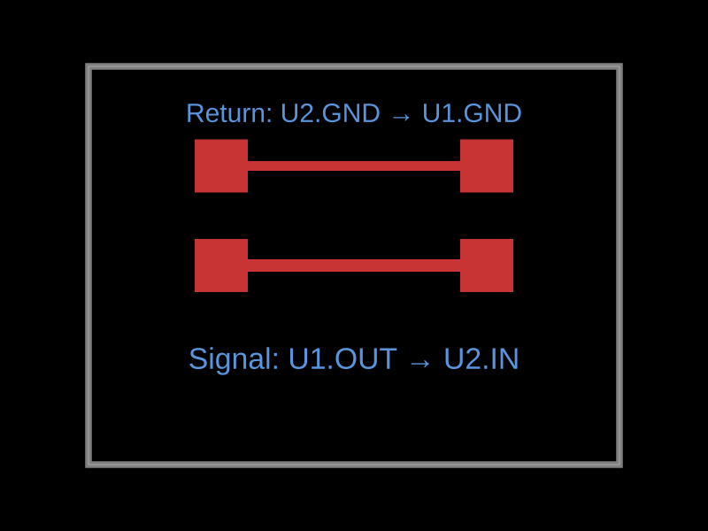

# PCB return-current experiment declarations

`<simulation.pcbreturncurrentsimulation>` declares a pending `pcb_return_current`
experiment in Circuit JSON. `<simulation.pcbreturncurrentexcitation>` specifies a routed
signal, a peak current, real port resistances and physical ground contacts.
Rendering these elements declares the experiment; it does not launch an EM
solver or produce simulation results.

Place the declaration inside a board or subcircuit. Its name is optional and
defaults to `"PCB return current"`. Multiple declarations create separate
experiments, and PCB-disabled rendering skips them. The elements use canonical
typed schemas from `@tscircuit/props`.

```tsx
import { simulation } from "@tscircuit/core"

<simulation.pcbreturncurrentsimulation name="DDR_D13 escape">
  <simulation.pcbreturncurrentexcitation
    source=".U1 > .DDR_D13"
    load=".U2 > .DQ13"
    trace=".DDR_D13"
    ground="net.GND"
    current="5mA"
    sourceImpedance="25ohm"
    loadImpedance="100ohm"
    returnSource=".U2 > .GND"
    returnSink=".U1 > .VSS"
  />
</simulation.pcbreturncurrentsimulation>
```

The flat `<pcbreturncurrentsimulation>` and `<pcbreturncurrentexcitation>`
forms remain supported with the same props and Circuit JSON output.

The selected signal ports and route must already exist on the PCB. The
selectors use the normal subcircuit scope, and `trace` is optional when the
source/load connection has exactly one complete routed trace. These elements
do not add electrical connections or change the original PCB route.

For positive signal current from `source` to `load`, return current enters
the ground conductor at the **load-side `returnSource`** and returns to the
driver at **`returnSink`**. The source port pairs the signal driver with
`returnSink`; the load port pairs the receiver with `returnSource`.

Both return contacts must select real component PCB pads or plated-hole ports
electrically connected to `ground`. No nearby ground pad, plane projection or
return path is inferred. A ground port spanning multiple layers requires
`returnSourceLayer` or `returnSinkLayer`; a specified layer must be present on
that port. Standalone via and copper-pour selectors are not supported by this
first TSX API. Signal and ground references must be distinct physical ports;
a same-layer contact at the signal position is rejected.

All electrical values are required. Raw current numbers are peak amperes;
raw impedance numbers are positive real ohms. Unit strings such as `"5mA"`,
`"25ohm"` and `"100Ω"` are accepted. Frequency, sampling cell size, copper
model, physical stackup and solver settings are run parameters supplied to
the simulation CLI, because pending experiment records do not have fields
for these settings. Unsupported TSX properties fail validation.

An empty `<simulation.pcbreturncurrentsimulation name="DDR escape" />` can reserve a
pending experiment. It cannot be simulated until an excitation is added.
An experiment can contain several excitations on **different** signal routes
sharing one ground net. Use separate experiments to compare currents,
directions or ground nets for the same route. Split or branched signal routes
are rejected rather than selecting an arbitrary segment.

After `await circuit.renderUntilSettled()`, save `circuit.getCircuitJson()`
and pass it to the [simulate-return-current CLI](https://github.com/tscircuit/simulate-return-current).
Select the generated experiment when several are present, supply the frequency
and physical solver settings, and read the resulting Circuit JSON separately.


